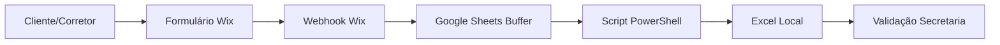
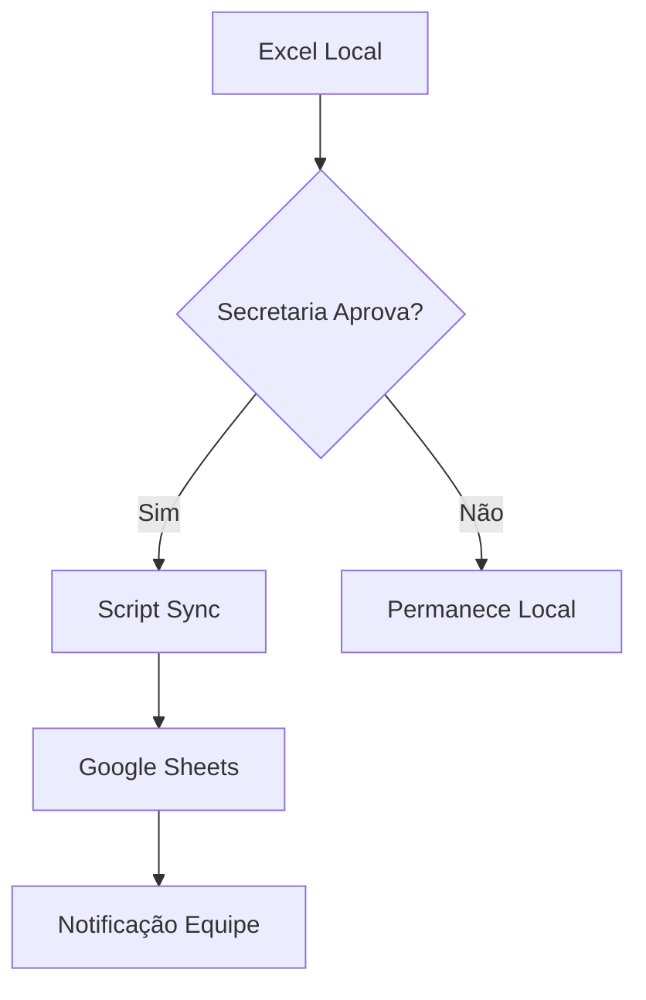
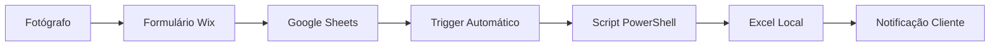
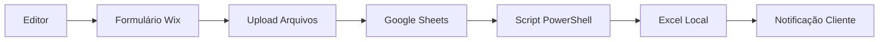
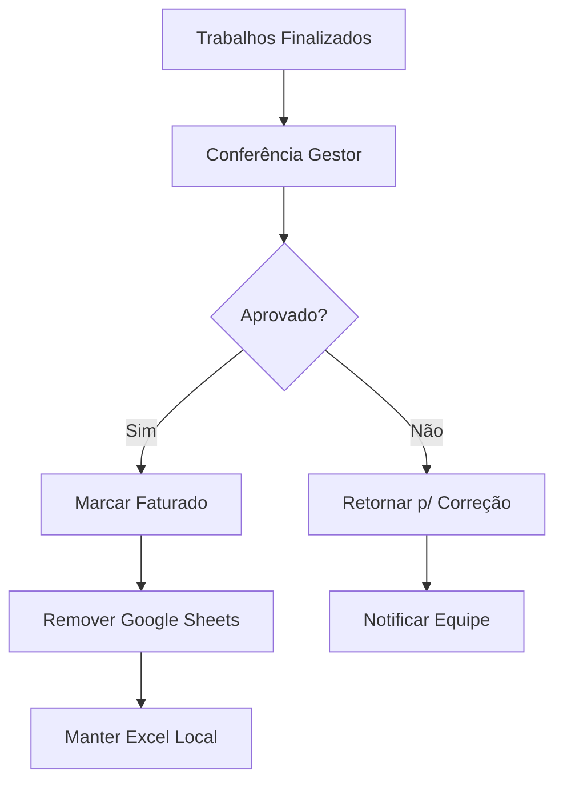

# Fluxo de Dados - Sistema Fotográfico Integrado

## Visão Geral do Fluxo

O sistema utiliza uma arquitetura de **3 camadas** com sincronização inteligente:

```
📊 Excel Local (Offline) ←→ ☁️ Google Sheets (Sync) ←→ 🌐 Wix (Online)
```

## Mapeamento Completo dos Dados

### 📁 **Estrutura de Dados Principal**

#### Excel Local (`d:\Projetos\Excel\csv_output\`)
```
├── Solicitacao.csv          # Dados principais dos pedidos
├── Clientes.csv             # Informações dos clientes
├── Corretores.csv           # Dados dos corretores
├── Fotografos.csv           # Cadastro de fotógrafos
├── Rede.csv                 # Redes imobiliárias
├── Regioes.csv              # Regiões de atendimento
└── CodigoVitrine.csv        # Códigos para download
```

#### Google Sheets (Sincronização)
```
├── 📋 Agendamentos_Publicados    # Para fotógrafos
├── 🎨 Trabalhos_Edicao          # Para editores
├── 👔 Conferencia_Gerencial     # Para gestores
└── 📊 Logs_Sincronizacao        # Auditoria
```

#### Wix (Interface Web)
```
├── 📝 Formulario_Novo_Pedido    # Entrada pública
├── 📸 Status_Fotografo          # Atualização fotógrafo
├── 🎨 Entrega_Editor           # Entrega de edição
└── 🔍 Consulta_Status          # Consulta pública
```

---

## 🔄 Fluxos de Dados Detalhados

### 1. 📥 **ENTRADA DE NOVOS PEDIDOS**

#### Fluxo A: Cliente → Wix → Excel Local


**Detalhamento Técnico:**
1. **Cliente preenche formulário** no Wix
2. **Wix envia webhook** para Google Sheets
3. **Google Sheets recebe dados** em planilha buffer
4. **Script PowerShell monitora** buffer a cada 5 minutos
5. **Dados são importados** para Excel local
6. **Secretaria valida** e processa o pedido

#### Fluxo B: Secretaria → Excel Local (Direto)


**Campos Capturados:**
- **Cliente**: Nome, telefone, email
- **Endereço**: Rua, número, bairro, cidade
- **Serviço**: Tipo (fotos/vídeo/drone/planta)
- **Preferências**: Data, horário, observações
- **Origem**: Wix ou Manual

### 2. 📤 **PUBLICAÇÃO PARA EQUIPE**

#### Excel Local → Google Sheets


**Processo de Publicação:**
1. **Secretaria seleciona** agendamentos para publicar
2. **Script PowerShell executa** sincronização
3. **Dados são filtrados** por nível de acesso
4. **Google Sheets atualizado** automaticamente
5. **Equipe recebe notificação** (email/app)

#### Dados Publicados por Planilha:

##### 📋 **Agendamentos_Publicados** (Fotógrafos)
```csv
Data,Horario,Cliente,Telefone,Endereco,Tipo_Servico,Observacoes,Codigo_Tracking
2025-01-17,14:00,João Silva,41999999999,Rua A 123 - Batel,Fotos,Apartamento novo,TRK001
```

##### 🎨 **Trabalhos_Edicao** (Editores)
```csv
Codigo_Vitrine,Tipo_Edicao,Prazo,Especificacoes,Obs_Fotografo,Status
VIT001,Fotos Residencial,2025-01-19,HDR + Correção,Boa iluminação,Aguardando
```

##### 👔 **Conferencia_Gerencial** (Gestores)
```csv
Codigo,Cliente,Fotografo,Editor,Data_Realizacao,Data_Edicao,Status,Valor
TRK001,João Silva,Carlos,Ana,2025-01-17,2025-01-18,Finalizado,R$ 300
```

### 3. 🔄 **ATUALIZAÇÕES DE STATUS**

#### Fotógrafo → Wix → Google Sheets → Excel Local


**Campos Atualizados pelo Fotógrafo:**
- **Status**: "Realizado"
- **Código Vitrine**: Para download das fotos
- **Observações**: Problemas ou destaques
- **Timestamp**: Data/hora da conclusão

#### Editor → Wix → Google Sheets → Excel Local


**Campos Atualizados pelo Editor:**
- **Status**: "Editado"
- **Links Entrega**: Google Drive, WeTransfer
- **Observações**: Detalhes da edição
- **Timestamp**: Data/hora da entrega

### 4. 💰 **PROCESSO DE FATURAMENTO**

#### Gestor → Conferência → Remoção Online


**Processo Detalhado:**
1. **Gestor acessa** trabalhos finalizados
2. **Confere qualidade** e conformidade
3. **Aprova ou reprova** cada trabalho
4. **Se aprovado**: marca como "Faturado"
5. **Dados removidos** do Google Sheets
6. **Histórico mantido** no Excel local

---

## 🔧 Scripts de Sincronização

### 📜 **Script Principal: `sync_tadabase_to_solicitacao.ps1`**

#### Função: Sincronização Bidirecional
```powershell
# Monitora mudanças a cada 5 minutos
while ($true) {
    # 1. Verifica novos pedidos no buffer Wix
    $novosPedidos = Import-Csv "buffer_wix.csv"
    
    # 2. Processa e valida dados
    foreach ($pedido in $novosPedidos) {
        Validate-PedidoData $pedido
        Add-ToSolicitacao $pedido
    }
    
    # 3. Sincroniza atualizações da equipe
    $atualizacoes = Get-GoogleSheetsUpdates
    Update-ExcelLocal $atualizacoes
    
    # 4. Publica novos agendamentos aprovados
    $agendamentos = Get-ApprovedAgendamentos
    Publish-ToGoogleSheets $agendamentos
    
    Start-Sleep 300 # 5 minutos
}
```

#### Logs de Sincronização:
```
[2025-01-17 14:30:15] INFO: Novo pedido recebido - Cliente: João Silva
[2025-01-17 14:30:16] SUCCESS: Pedido validado e adicionado - ID: SOL001
[2025-01-17 14:35:22] INFO: Status atualizado - Fotógrafo: Carlos - Status: Realizado
[2025-01-17 14:35:23] SUCCESS: Sincronização completa - 3 atualizações processadas
```

### 📜 **Scripts Auxiliares**

#### `validate_*.ps1` - Validação de Dados
- **validate_client_names.ps1**: Valida nomes de clientes
- **validate_corretor.ps1**: Valida dados de corretores
- **validate_fotografo.ps1**: Valida disponibilidade
- **validate_rede.ps1**: Valida redes imobiliárias

#### `export_*.ps1` - Exportação
- **export_solicitacao_columns.ps1**: Exporta estrutura
- **build_solicitacao_columns.ps1**: Reconstrói colunas

---

## 🔐 Segurança e Integridade

### 🛡️ **Controle de Acesso aos Dados**

#### Por Nível de Usuário:
```json
{
  "secretaria": {
    "excel_local": "full_access",
    "google_sheets": "admin",
    "wix": "admin"
  },
  "fotografo": {
    "excel_local": "no_access",
    "google_sheets": "read_agendamentos",
    "wix": "update_status"
  },
  "editor": {
    "excel_local": "no_access", 
    "google_sheets": "read_trabalhos",
    "wix": "upload_edicao"
  },
  "gestor": {
    "excel_local": "read_reports",
    "google_sheets": "read_conferencia", 
    "wix": "read_only"
  }
}
```

### 🔒 **Criptografia e Backup**

#### Dados Sensíveis (Excel Local):
- **Criptografia AES-256** para dados financeiros
- **Backup automático** a cada alteração
- **Versionamento** com 30 dias de histórico
- **Acesso físico restrito** à máquina

#### Dados Públicos (Google Sheets):
- **Dados anonimizados** quando possível
- **Remoção automática** após faturamento
- **Logs de acesso** completos
- **Compartilhamento por email** específico

### 📊 **Monitoramento e Auditoria**

#### Logs Automáticos:
```
├── sync_logs/
│   ├── 2025-01-17_sync.log      # Log diário de sincronização
│   ├── 2025-01-17_errors.log    # Erros e exceções
│   └── 2025-01-17_access.log    # Acessos por usuário
```

#### Métricas Monitoradas:
- **Tempo de sincronização** (meta: < 30 segundos)
- **Taxa de erro** (meta: < 1%)
- **Disponibilidade** (meta: 99.9%)
- **Uso por nível** de acesso

---

## 🚨 Tratamento de Erros

### ⚠️ **Cenários de Erro Comuns**

#### 1. **Falha na Sincronização**
```powershell
try {
    Sync-GoogleSheets
} catch {
    Write-Log "ERRO: Falha na sincronização - $($_.Exception.Message)"
    Send-AlertEmail "admin@empresa.com"
    Use-BackupData
}
```

#### 2. **Dados Corrompidos**
```powershell
if (Test-DataIntegrity -eq $false) {
    Restore-FromBackup
    Write-Log "WARNING: Dados restaurados do backup"
    Validate-AllData
}
```

#### 3. **Acesso Não Autorizado**
```powershell
if (Test-UserPermission -eq $false) {
    Block-Access
    Log-SecurityIncident
    Send-SecurityAlert
}
```

### 🔄 **Recuperação Automática**

#### Estratégias de Fallback:
1. **Retry automático** (3 tentativas)
2. **Backup local** como fonte alternativa
3. **Modo offline** temporário
4. **Notificação imediata** da equipe técnica

---

## 📈 Performance e Otimização

### ⚡ **Otimizações Implementadas**

#### Cache Inteligente:
- **Cache local** de 5 minutos para dados frequentes
- **Compressão** de arquivos CSV grandes
- **Índices** para busca rápida
- **Lazy loading** de dados não críticos

#### Sincronização Eficiente:
- **Delta sync** (apenas mudanças)
- **Batch processing** para múltiplas atualizações
- **Priorização** por tipo de dados
- **Throttling** para evitar sobrecarga

### 📊 **Métricas de Performance**

#### Tempos Esperados:
- **Sincronização completa**: < 30 segundos
- **Atualização de status**: < 5 segundos
- **Carregamento de dados**: < 3 segundos
- **Backup automático**: < 10 segundos

---

## 🔮 Evolução Futura

### 🚀 **Próximas Implementações**

#### Fase 2 - Automação Avançada:
- **IA para otimização** de rotas de fotógrafos
- **Predição de demanda** por região
- **Automação de agendamentos**
- **Análise preditiva** de qualidade

#### Fase 3 - Integração Completa:
- **API REST** para integrações externas
- **App mobile nativo** para equipe
- **Integração com CRM** imobiliário
- **Sistema de pagamento** integrado

### 📱 **Roadmap Tecnológico**

#### 2025 Q1:
- Implementação completa Wix + Google Sheets
- Sistema de notificações automáticas
- Dashboard gerencial avançado

#### 2025 Q2:
- App mobile para fotógrafos
- IA para otimização de processos
- Integração com sistemas externos

#### 2025 Q3:
- Análise preditiva completa
- Automação total de fluxos
- Expansão para novos mercados